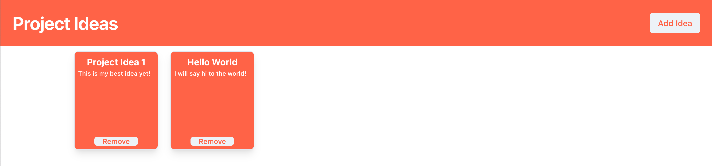

# Project Ideas Client

Before starting, check out a live-demo of what you'll be building at https://ideas.dev.hack.gt

## Introduction

This tutorial will go over building the front-end of our project ideas application. By this point, you should have a a fully working web server running on NodeJS/Express. Our goal now is to build the actual user interface that our user will interact with.

For simple websites (i.e. personal website, wiki page, etc.), using vanilla HTML/CSS/JS usually suffices. However, when our webpage has a lot of components and user interactivity, ReactJS can be a good tool to use. React relies on 3 key ideas:

- **Reuseable Components**: _React provides an intuitive way to create components & re-use them wherever we want to in an application_
- **State-Based Rendering**: _React maintains an internal representation of the webpage & efficiently updates this when the "state" of a component changes. Whenever something happens in the application (i.e. user clicks a button), React will figure out which components need to be re-rendered and only update those components_
- **Information passing**: _Data in your components are passed in through a concept called "props". Components can access the props that are passed into it & use that information to decide what to render._

### Components

Components are the core of React. Every application is essentially made up of a component hierarchy. The first step when making a react application is to think about how you want to design your components. For example, in our Project Ideas app: 

A possible component hierarcy would be:

- App Container
  - ProjectContainer Component
    - Header Component
    - ProjectGrid Component
      - ProjectCard Component

We see 2 keywords here: _Container_ and _Component_- this brings us to our next concept: Presentational Components vs. Container Components.

A Presentational Component is a component that is responsible for taking in information and displaying it appropriately to the user. In our app, the ProjectCard is an example of a presentational component because it is only responsible for displaying the card to the User. In this case, our ProjectCard component would take in information (called "props") like the Project title & the Project description, and _display_ it to the user.

A Container component, sometimes called a "Smart Component" or a _Stateful Components_, is primarily a data source for Presentational components. This component is responsible for the actual business-logic: one common use-case for Container components is to fetch data from APIs and store it in the container's state. In our app, the ProjectContainer component is responsible for making the API call to fetch the user's project ideas and store it in its state. The component will then pass in this information as props into the ProjectGrid "Presentational" component, which will render the ProjectCards on the user's screen.

When the user refreshes the webpage, the following sequence will happen:

- ProjectContainer Fetches Ideas from API
- ProjectContainer stores the fetched ideas in _state_
- ProjectContainer will pass this data into the ProjectGrid component via _props_
- ProjectGrid will read its props and render ProjectCards for each "project idea"
- Each ProjectCard will receive a project idea from ProjectGrid in its props & render the corresponding title & description

### Props

So what exactly are props? Props are nothing but information that is passed into a component. In our previous example, "title" and "description" are props that are passed into the ProjectCard component. Each ProjectCard has read-only access to these props and can render this to the user using HTML. A very simple example of this would be:

```html
<h1>{this.props.title}</h1>
<p>{this.props.description}</p>
```

We'll see a more detailed example as we implement the ProjectCard component later in this tutorial.

The key idea to understand about props is that they can **only** be passed from a _parent component to a child component_. Later in this tutorial, we'll look at how this could potentially be a problem & how we can resolve it.

### State

We've mentioned "state" quite a bit so far. The state is the information that is subject to change in a component. In our app, an example of "state" would be the list of project ideas since users need to be able to add/remove ideas. For example, when a user adds an idea, we want to add it to our state.

The fundamental concept to understand about state is that changing it triggers re-renders. Whenever a component's state changes, React will automatically re-render the component & thus all of the component's child components. In our case, we will maintain the state of ideas in the ProjectContainer Component- whenever this state changes, Ract will re-render the ProjectGrid & Header components since they are children.

The most powerful part of state is the ability to pass them in as props into child components. Here's a snippet of this in React syntax. We'll call this component ProjectContainer:

```html
ProjectContainer.tsx 
[titleState, setTitle] = useState(""); 
...
<ProjectCard title="{titleState}" />
```

Don't worry about the syntax here. The main concept to understand is that `ProjectCard` takes in a prop called `title`. Our `ProjectContainer` contains a state variable called "titleState". We pass this state into ProjectCard's `title` prop. Now, whenever `titleState` changes, the `ProjectContainer` will re-render and `ProjectCard` will get the new title.

---

Congrats! You should now have a decent understanding of how React works at the high-level. Now, let's get our hands dirty and start building our app :)
